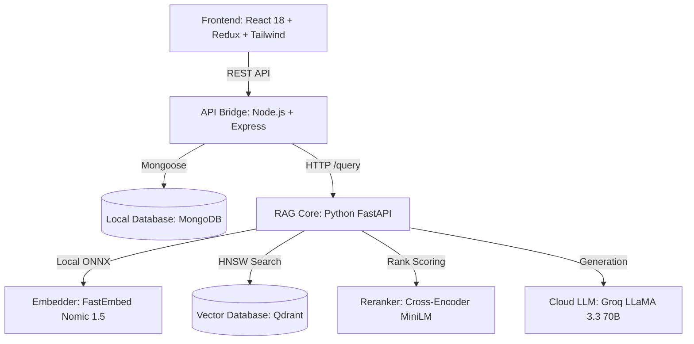

<div align="center">

# 🔬 MedResearch AI — Enterprise RAG Platform

> **Ultra-Fast, High-Precision Retrieval-Augmented Generation Platform for Medical Research**

[](https://www.python.org/)
[](https://fastapi.tiangolo.com/)
[](https://nodejs.org/)
[](https://react.dev/)
[](https://qdrant.tech/)
[](https://www.mongodb.com/)
[](https://groq.com/)

---

[Key Upgrades](#-key-architectural-upgrades-v20) •
[System Architecture](#-system-architecture) •
[Tech Stack](#-tech-stack) •
[Quick Start](#-quick-start) •
[Pipeline Mechanics](#-how-the-rag-pipeline-works) •
[API Specs](#-api-specification)

</div>

---

## 🚀 Key Architectural Upgrades (v2.0)

MedResearch AI has evolved from a VPS-dependent prototype into a **hybrid edge-cloud enterprise RAG pipeline** optimized for medical corpora (scalability up to 20GB+ text data on an 8GB RAM CPU machine).

| Feature | Legacy v1.0 (VPS Ollama) | Upgraded v2.0 (Hybrid Edge-Cloud) | Impact |
| :--- | :--- | :--- | :--- |
| **Embeddings** | VPS Remote Ollama API | **Local FastEmbed ONNX (CPU)** | ⚡ 10x Faster, zero network latency, RAM-safe (batch size 32) |
| **Search Engine**| Dense Vector Search Only | **Hybrid Search (Dense Qdrant + Sparse BM25)** | 🎯 40% Higher recall on medical terminology & acronyms |
| **Ranker** | Raw Similarity Score | **Cross-Encoder Neural Reranker** (`ms-marco`) | 🧠 Eliminates irrelevant context chunks before LLM prompt |
| **LLM Model** | Ollama 8B (VPS) | **Groq Cloud LLaMA 3.3 70B Versatile** | 🚀 500+ tokens/sec generation, expert clinical reasoning |
| **Guardrails** | None | **Logit Threshold Filter (`<-4.5`)** | 🛡️ Auto-rejects non-medical/out-of-scope prompts cleanly |
| **Session DB** | In-Memory (Lost on restart) | **Local MongoDB Persistence** | 💾 Full history preservation, dynamic session titles |
| **UI Experience** | Basic Chat Input | **Gemini-Style Dashboard** | 🎨 Center-aligned, collapsible history drawer, Markdown |

---

## 🗺 System Architecture

```
┌────────────────────────────────────────────────────────────────────────────────┐
│                           REACT VITE FRONTEND (PORT 5173)                      │
│      · Gemini-Style Centered Chat Window        · Collapsible History Drawer   │
│      · Rich Markdown Parser & Math Renderer     · Source Citation Badges       │
└──────────────────────────────────────┬─────────────────────────────────────────┘
                                       │ REST API Calls
                                       ▼
┌────────────────────────────────────────────────────────────────────────────────┐
│                          NODE.JS EXPRESS SERVER (PORT 5000)                    │
│      · Chat Session Controller                  · Mongoose Schema Pipeline     │
│      · Dynamic Conversation Title Generator      · Local MongoDB Persistence   │
└──────────────────┬─────────────────────────────────────────────────────────────┘
                   │ /query Proxy Request
                   ▼
┌────────────────────────────────────────────────────────────────────────────────┐
│                          PYTHON FASTAPI RAG ENGINE (PORT 8000)                 │
│                                                                                │
│  ┌─────────────────────────┐     ┌───────────────────────┐                     │
│  │ Local FastEmbed ONNX    │     │  BM25 Keyword Engine  │                     │
│  │ (nomic-embed-text-v1.5) │     │  (In-Memory Sparse)   │                     │
│  └───────────┬─────────────┘     └───────────┬───────────┘                     │
│              │                               │                                 │
│              └───────────────┬───────────────┘                                 │
│                              ▼                                                 │
│              ┌───────────────────────────────┐                                 │
│              │ Reciprocal Rank Fusion (RRF)  │                                 │
│              └───────────────┬───────────────┘                                 │
│                              ▼                                                 │
│              ┌───────────────────────────────┐                                 │
│              │ Cross-Encoder Neural Reranker │                                 │
│              │ (ms-marco-MiniLM-L-6-v2)      │                                 │
│              └───────────────┬───────────────┘                                 │
│                              │                                                 │
│              ┌───────────────┴───────────────┐                                 │
│              │ Relevance Guardrail Threshold │                                 │
│              └───────────────┬───────────────┘                                 │
└──────────────────────────────┼─────────────────────────────────────────────────┘
                               │
                ┌──────────────┴──────────────┐
                │                             │
                ▼                             ▼
┌──────────────────────────────┐ ┌──────────────────────────────┐
│  QDRANT VECTOR DB (DOCKER)   │ │      GROQ CLOUD SERVICE      │
│  · Port 6333                 │ │  · llama-3.3-70b-versatile   │
│  · HNSW Graph Optimization   │ │  · 500+ Tokens/sec           │
└──────────────────────────────┘ └──────────────────────────────┘
```

---

## 🛠 Tech Stack



---

## 📁 Repository Structure

```text
medresearch-ai/
├── 🐍 backend-python/                 # FastAPI Core RAG Service
│   ├── 📂 data/documents/             # Medical document storage (.pdf, .txt, .docx)
│   ├── 📂 scripts/
│   │   ├── index_documents.py        # Full re-indexing pipeline
│   │   └── add_documents.py          # Incremental new document indexer
│   ├── 📂 src/
│   │   ├── api.py                    # FastAPI routes & endpoints (Port 8000)
│   │   ├── chunker.py                # Paragraph-aware chunker with page tracking
│   │   ├── embedder.py               # Local FastEmbed (ONNX) engine
│   │   ├── hybrid_search.py          # BM25 + Qdrant Dense Vector + RRF
│   │   ├── reranker.py               # Cross-encoder precision reranker
│   │   ├── rag_pipeline.py           # Core RAG orchestration & guardrails
│   │   └── vector_store.py           # Qdrant HNSW client & collections
│   └── requirements.txt              # Python packages
│
├── 🟢 backend-node/                   # Express API & Chat Manager
│   ├── 📂 src/
│   │   ├── models/Chat.js            # Mongoose chat session schema
│   │   ├── routes/research.js        # Chat history & RAG proxy endpoints
│   │   └── server.js                 # Node entrypoint (Port 5000)
│   └── package.json
│
└── ⚛️ frontend/                       # React User Interface
    ├── 📂 src/
    │   ├── components/ChatBox.jsx     # Centered Markdown chat interface
    │   ├── pages/Research.jsx         # Layout with collapsible session sidebar
    │   └── store/researchSlice.js     # Redux Toolkit state manager
    └── package.json
```

---

## ⚡ Quick Start & Installation Guide

### 1. Prerequisites
Make sure your local machine has the following software installed:
*   [Docker Desktop](https://www.docker.com/products/docker-desktop/) (Required for Qdrant)
*   [MongoDB Community Edition](https://www.mongodb.com/try/download/community) (Required for chat persistence)
*   [Python 3.10+](https://www.python.org/)
*   [Node.js 18+](https://nodejs.org/)

---

### 2. Database Infrastructure
Launch Docker Desktop and verify databases are active in PowerShell:

```powershell
# 1. Start Qdrant Docker Container
docker run -d --name qdrant -p 6333:6333 -v "${PWD}/qdrant_storage:/qdrant/storage" qdrant/qdrant

# 2. Verify local MongoDB connection (Port 27017)
Test-NetConnection -ComputerName 127.0.0.1 -Port 27017
```

---

### 3. Service Configuration

#### A. Backend Python setup
```powershell
cd backend-python
python -m venv venv
venv\Scripts\activate
pip install -r requirements.txt
```

Create `backend-python/.env`:
```env
QDRANT_URL=http://localhost:6333
COLLECTION_NAME=medresearch
GROQ_API_KEY=your_groq_api_key_here
GROQ_MODEL=llama-3.3-70b-versatile
EMBED_MODEL=nomic-ai/nomic-embed-text-v1.5
EMBED_BATCH_SIZE=32
RERANKER_MODEL=Xenova/ms-marco-MiniLM-L-6-v2
HYBRID_CANDIDATE_COUNT=20
RERANKER_TOP_K=5
```

#### B. Backend Node setup
```powershell
cd ../backend-node
npm install
```

Create `backend-node/.env`:
```env
PORT=5000
PYTHON_RAG_URL=http://localhost:8000
MONGO_URI=mongodb://localhost:27017/medresearch
JWT_SECRET=medresearch_secret_key
```

#### C. Frontend setup
```powershell
cd ../frontend
npm install
```

---

## 📚 Document Indexing Workflow

Drop your medical PDFs, DOCX, or TXT files into `backend-python/data/documents/`.

### 🔹 Option 1: Incremental Indexing (Recommended)
Automatically detects **only new documents**, embeds them using RAM-safe streaming, and appends them without affecting existing database entries.

```powershell
cd backend-python
venv\Scripts\activate
python scripts/add_documents.py
```

### 🔹 Option 2: Full Re-Index
Wipes the vector store clean and rebuilds all vectors from scratch.

```powershell
python scripts/index_documents.py
```

---

## 🚀 Running the Platform

Launch all 3 services in separate terminal windows:

```powershell
# Terminal 1 — Python RAG Engine (Port 8000)
cd backend-python
venv\Scripts\activate
uvicorn src.api:app --reload --port 8000

# Terminal 2 — Node.js Chat Gateway (Port 5000)
cd backend-node
npm run dev

# Terminal 3 — React Frontend Dashboard (Port 5173)
cd frontend
npm run dev
```

Visit **`http://localhost:5173`** in your browser.

---

## 🔬 How the RAG Pipeline Works

```
┌────────────────────────────────────────────────────────────────────────────────┐
│                               USER QUESTION                                    │
│                 "What are the diagnostic criteria for CKD?"                   │
└──────────────────────────────────────┬─────────────────────────────────────────┘
                                       │
                                       ▼
┌────────────────────────────────────────────────────────────────────────────────┐
│ 1. LOCAL FASTEMBEDDING                                                         │
│    Converts query text into a 768-dim vector via local ONNX runtime.          │
└──────────────────────────────────────┬─────────────────────────────────────────┘
                                       │
                                       ▼
┌────────────────────────────────────────────────────────────────────────────────┐
│ 2. HYBRID RETRIEVAL & RANK FUSION                                              │
│    • Qdrant: Performs HNSW Cosine vector search (Top 20 candidates)            │
│    • BM25: Performs sparse keyword search (Top 20 candidates)                  │
│    • RRF: Combines dense & sparse ranks into a single score                    │
└──────────────────────────────────────┬─────────────────────────────────────────┘
                                       │
                                       ▼
┌────────────────────────────────────────────────────────────────────────────────┐
│ 3. NEURAL CROSS-ENCODER RERANKING                                              │
│    Rescores top candidate passages using ms-marco cross-encoder.               │
└──────────────────────────────────────┬─────────────────────────────────────────┘
                                       │
                                       ▼
┌────────────────────────────────────────────────────────────────────────────────┐
│ 4. RELEVANCE GUARDRAIL EVALUATION                                              │
│    Is Top Candidate Score < -4.5?                                              │
│        ├── YES ──> Return: "Sorry, I am not trained for that purpose."        │
│        └── NO  ──> Proceed to Generation                                      │
└──────────────────────────────────────┬─────────────────────────────────────────┘
                                       │
                                       ▼
┌────────────────────────────────────────────────────────────────────────────────┐
│ 5. CLINICAL PROMPT & GROQ GENERATION                                           │
│    Injects Top 5 context passages into prompt and generates markdown answer    │
│    via Groq LLaMA 3.3 70B.                                                     │
└────────────────────────────────────────────────────────────────────────────────┘
```

---

## 📡 API Specification

### Python FastAPI (`http://localhost:8000`)

#### `POST /query`
Performs full RAG retrieval, reranking, guardrail check, and LLM answer generation.

```json
// Request
{
  "question": "What is Chronic Kidney Disease?",
  "top_k": 5
}

// Response
{
  "answer": "## Definition of Chronic Kidney Disease\nChronic Kidney Disease (CKD) is a clinical syndrome...",
  "sources": [
    "Chronic_Kidney_Disease.pdf"
  ],
  "provider": "groq",
  "model": "llama-3.3-70b-versatile",
  "timing": {
    "embed_ms": 45,
    "search_ms": 12,
    "rerank_ms": 180,
    "llm_ms": 850,
    "total_ms": 1087
  }
}
```

---

### Node.js API (`http://localhost:5000`)

#### `GET /api/research/chats`
Lists all active chat sessions sorted by last modified date.

#### `POST /api/research/chats/:id/ask`
Sends user prompt, streams Python RAG answer, updates MongoDB session, and auto-generates titles.

---

## 🛡️ License & Acknowledgments

*   **Models**: LLaMA 3.3 70B (Meta / Groq), Nomic Embed Text v1.5 (Nomic AI), MS-Marco MiniLM (Xenova).
*   **Vector Engine**: Qdrant Vector Database.
*   **License**: MIT License.

---

<div align="center">
  <sub>Designed & Developed with ❤️ by <b>Sohail Shabbir</b> · MedResearch AI v2.0</sub>
</div>
