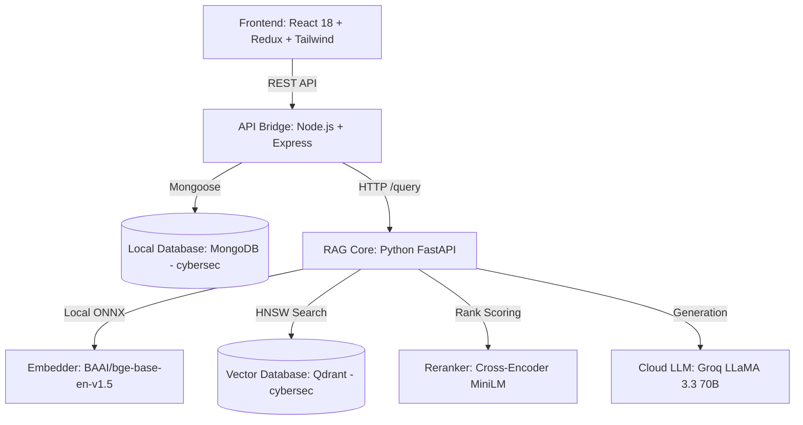

<div align="center">

# 🛡️ CyberSecAI — Ethical Hacking & Cybersecurity RAG Platform

> **High-Precision Retrieval-Augmented Generation Platform for Ethical Hacking, CTFs, CVE Analysis & Security Research**

[](https://www.python.org/)
[](https://fastapi.tiangolo.com/)
[](https://nodejs.org/)
[](https://react.dev/)
[](https://qdrant.tech/)
[](https://www.mongodb.com/)
[](https://groq.com/)

---

[Key Features](#-key-features--upgrades-v40) •
[System Architecture](#-system-architecture) •
[Tech Stack](#-tech-stack) •
[Quick Start](#-quick-start--installation-guide) •
[Document Indexing](#-document-indexing-workflow) •
[Multi-Language Code Generation](#-multi-language-code-generation) •
[API Specs](#-api-specification)

</div>

---

## 🚀 Key Features & Upgrades (v4.0)

CyberSecAI is an **ultra-accurate hybrid RAG platform** engineered specifically for ethical hacking books, penetration testing guides, CVE databases, and CTF writeups. Optimized to run smoothly on 8GB RAM machines.

| Feature | Legacy System | Upgraded CyberSecAI v4.0 | Impact |
| :--- | :--- | :--- | :--- |
| **Domain Persona** | Medical Research | **Ethical Hacking & Cybersecurity Expert** | 🎯 Specialized for CVEs, penetration testing, exploit analysis, and defense mitigations |
| **Embedding Model** | Nomic Embed v1.5 | **BAAI/bge-base-en-v1.5 (Local FastEmbed ONNX)** | ⚡ Superior semantic retrieval for technical English & cybersecurity terminology |
| **Chunking Strategy** | Fixed 400-token splitting | **Semantic Boundaries & Fenced Code Preservation (600/100 tokens)** | 🧠 Preserves full code blocks, section headers, and multi-step attack sequences |
| **Search Engine** | Basic Hybrid Search | **Acronym-Expanded Hybrid Search (Dense Qdrant + Sparse BM25)** | 🔍 Auto-expands 50+ cybersec acronyms (`SQLi`, `RCE`, `XSS`, `privesc`, `ASLR`, `ROP`, etc.) |
| **Code Generation** | Basic Snippets | **Multi-Language Exploitation & Tooling** | 💻 Production-ready code in Python, Bash, C/C++, JavaScript, PowerShell, Ruby, SQL, Assembly |
| **Answer Styles** | Short / Classical / Detailed | **Short / Technical / Detailed / CTF Mode** | 🛠️ Tailored depth ranging from quick payload lookups to CTF hint breakdowns |
| **Relevance Threshold** | Strict -2.0 Threshold | **Calibrated -3.5 Threshold & 8 Context Chunks** | 🛡️ Prevents false refusals on dense technical jargon while keeping strict anti-hallucination guardrails |

---

## 🗺 System Architecture

```text
┌────────────────────────────────────────────────────────────────────────────────┐
│                           REACT VITE FRONTEND (PORT 5173)                      │
│      · CyberSec Dashboard Interface             · Collapsible History Drawer   │
│      · Markdown & Code Block Parser             · Source Citation Badges       │
└──────────────────────────────────────┬─────────────────────────────────────────┘
                                       │ REST API Calls
                                       ▼
┌────────────────────────────────────────────────────────────────────────────────┐
│                          NODE.JS EXPRESS SERVER (PORT 5000)                    │
│      · Chat Session Controller                  · Mongoose Schema Pipeline     │
│      · Dynamic Conversation Title Generator      · Local MongoDB Persistence   │
└──────────────────┬─────────────────────────────────────────────────────────────┘
                   │ /query Proxy Request
                   ▼
┌────────────────────────────────────────────────────────────────────────────────┐
│                          PYTHON FASTAPI RAG ENGINE (PORT 8000)                 │
│                                                                                │
│  ┌─────────────────────────┐     ┌───────────────────────┐                     │
│  │ FastEmbed ONNX BGE-Base │     │ Cybersec BM25 Engine  │                     │
│  │ (768-dim Embeddings)    │     │ (Acronym Expansion)   │                     │
│  └───────────┬─────────────┘     └───────────┬───────────┘                     │
│              │                               │                                 │
│              └───────────────┬───────────────┘                                 │
│                              ▼                                                 │
│              ┌───────────────────────────────┐                                 │
│              │ Reciprocal Rank Fusion (RRF)  │                                 │
│              └───────────────┬───────────────┘                                 │
│                              ▼                                                 │
│              ┌───────────────────────────────┐                                 │
│              │ Cross-Encoder Neural Reranker │                                 │
│              │ (ms-marco-MiniLM-L-6-v2)      │                                 │
│              └───────────────┬───────────────┘                                 │
│                              │                                                 │
│              ┌───────────────┴───────────────┐                                 │
│              │ Relevance Guardrail Threshold │                                 │
│              └───────────────┬───────────────┘                                 │
└──────────────────────────────┼─────────────────────────────────────────────────┘
                               │
                ┌──────────────┴──────────────┐
                │                             │
                ▼                             ▼
┌──────────────────────────────┐ ┌──────────────────────────────┐
│  QDRANT VECTOR DB (DOCKER)   │ │      GROQ CLOUD SERVICE      │
│  · Collection: `cybersec`    │ │  · llama-3.3-70b-versatile   │
│  · HNSW Graph Optimization   │ │  · CyberSec System Prompts   │
└──────────────────────────────┘ └──────────────────────────────┘
```

---

## 🛠 Tech Stack



---

## 💻 Multi-Language Code Generation

CyberSecAI produces customized, production-ready security tooling, payloads, and scripts across multiple programming languages directly derived from your indexed books:

- **Python**: Exploit scripts, port scanners, custom fuzzers, packet manipulators
- **Bash / Shell**: Reconnaissance scripts, command one-liners, enumeration chains
- **C / C++**: Memory safety PoCs, buffer overflow demonstrations, shellcode harnesses
- **JavaScript / Node.js**: DOM/Reflected XSS payloads, CORS/CSRF PoCs, web scraping tools
- **PowerShell**: Active Directory post-exploitation, Windows security audit automation
- **Ruby**: Custom Metasploit module structures
- **SQL**: Injection strings, auth-bypass payloads, database enumeration queries
- **Assembly (x86 / x64)**: Shellcode examples, register manipulation, instruction inspection

---

## 📁 Repository Structure

```text
medresearch-ai/
├── 🐍 backend-python/                 # FastAPI Core RAG Service
│   ├── 📂 data/documents/             # Cybersec document storage (.pdf, .txt, .docx, .md)
│   ├── 📂 scripts/
│   │   ├── index_documents.py        # Full re-indexing pipeline (Semantic Chunking)
│   │   └── add_documents.py          # Incremental new document indexer
│   ├── 📂 src/
│   │   ├── api.py                    # FastAPI endpoints & streaming (Port 8000)
│   │   ├── chunker.py                # Semantic & Code-aware document chunker
│   │   ├── embedder.py               # Local BGE-base FastEmbed (ONNX) engine
│   │   ├── hybrid_search.py          # Acronym-Expanded BM25 + Qdrant Vector + RRF
│   │   ├── reranker.py               # Cross-encoder precision reranker
│   │   ├── rag_pipeline.py           # CyberSecAI persona, prompts & guardrails
│   │   └── vector_store.py           # Qdrant client & 'cybersec' collection
│   └── requirements.txt              # Python packages
│
├── 🟢 backend-node/                   # Express API & Chat Manager
│   ├── 📂 src/
│   │   ├── models/Chat.js            # Mongoose chat session schema
│   │   ├── routes/research.js        # Chat history & RAG proxy endpoints
│   │   └── server.js                 # Node entrypoint (Port 5000)
│   └── package.json
│
└── ⚛️ frontend/                       # React User Interface
    ├── 📂 src/
    │   ├── components/ChatBox.jsx     # Markdown & Code-highlighted chat window
    │   ├── pages/Research.jsx         # CyberSecAI dashboard & sidebar
    │   └── store/researchSlice.js     # Redux Toolkit state manager
    └── package.json
```

---

## ⚡ Quick Start & Installation Guide

### 1. Prerequisites
Ensure your local machine has the following software installed:
*   [Docker Desktop](https://www.docker.com/products/docker-desktop/) (For running local Qdrant)
*   [MongoDB Community Edition](https://www.mongodb.com/try/download/community) (For session persistence)
*   [Python 3.10+](https://www.python.org/)
*   [Node.js 18+](https://nodejs.org/)

---

### 2. Infrastructure Setup
Launch Docker Desktop and verify local databases in PowerShell:

```powershell
# 1. Start Qdrant Docker Container
docker run -d --name qdrant -p 6333:6333 -v "${PWD}/qdrant_storage:/qdrant/storage" qdrant/qdrant

# 2. Verify local MongoDB connection (Port 27017)
Test-NetConnection -ComputerName 127.0.0.1 -Port 27017
```

---

### 3. Service Configuration

#### A. Backend Python setup
```powershell
cd backend-python
python -m venv venv
.\venv\Scripts\activate
pip install -r requirements.txt
```

Create `backend-python/.env`:
```env
QDRANT_URL=http://localhost:6333
COLLECTION_NAME=cybersec
GROQ_API_KEY=your_groq_api_key_here
GROQ_MODEL=llama-3.3-70b-versatile
EMBED_MODEL=BAAI/bge-base-en-v1.5
EMBED_BATCH_SIZE=16
RERANKER_MODEL=Xenova/ms-marco-MiniLM-L-6-v2
HYBRID_CANDIDATE_COUNT=30
RERANKER_TOP_K=8
RELEVANCE_THRESHOLD=-3.5
MIN_RELEVANT_CHUNKS=1
```

#### B. Backend Node setup
```powershell
cd ../backend-node
npm install
```

Create `backend-node/.env`:
```env
PORT=5000
PYTHON_RAG_URL=http://localhost:8000
MONGO_URI=mongodb://localhost:27017/cybersec
JWT_SECRET=cybersec_secret_key
```

#### C. Frontend setup
```powershell
cd ../frontend
npm install
```

---

## 📚 Document Indexing Workflow

Place your ethical hacking PDFs, TXT, DOCX, or Markdown (.md) books into `backend-python/data/documents/`.

### 🔹 Full Re-Index (Recommended after updates)
Cleans the `cybersec` collection in Qdrant and rebuilds all vector & BM25 indices with semantic chunking:

```powershell
cd backend-python
.\venv\Scripts\python.exe scripts/index_documents.py
```

### 🔹 Incremental Indexing
Indexes only newly added document files without wiping existing vector data:

```powershell
.\venv\Scripts\python.exe scripts/add_documents.py
```

---

## 🚀 Running the Platform

Run all 3 services in separate PowerShell windows:

```powershell
# Terminal 1 — Python RAG Engine (Port 8000)
cd backend-python
.\venv\Scripts\uvicorn src.api:app --reload --port 8000

# Terminal 2 — Node.js Chat Gateway (Port 5000)
cd backend-node
npm run dev

# Terminal 3 — React Dashboard (Port 5173)
cd frontend
npm run dev
```

Open **`http://localhost:5173`** in your browser.

---

## 📡 API Specification

### Python FastAPI (`http://localhost:8000`)

#### `POST /query`
Standard RAG query endpoint returning generated answer and source document citations.

```json
// Request
{
  "question": "How does a buffer overflow vulnerability occur in C?",
  "answer_style": "technical",
  "top_k": 8
}

// Response
{
  "answer": "## Buffer Overflow Vulnerabilities in C\n\nA buffer overflow occurs when...",
  "sources": [
    "Gray_Hat_Hacking.pdf"
  ],
  "provider": "groq",
  "model": "llama-3.3-70b-versatile"
}
```

#### `POST /stream`
Server-Sent Events (SSE) streaming endpoint delivering token-by-token responses with guardrail validation.

---

## 🛡️ License & Acknowledgments

*   **Models**: LLaMA 3.3 70B (Meta / Groq), BGE-Base-EN-v1.5 (BAAI), MS-Marco MiniLM (Xenova).
*   **Vector Engine**: Qdrant Vector Database.
*   **License**: MIT License.

---

<div align="center">
  <sub>Maintained with ❤️ by <b>Sohail Shabbir</b> · CyberSecAI v4.0</sub>
</div>
